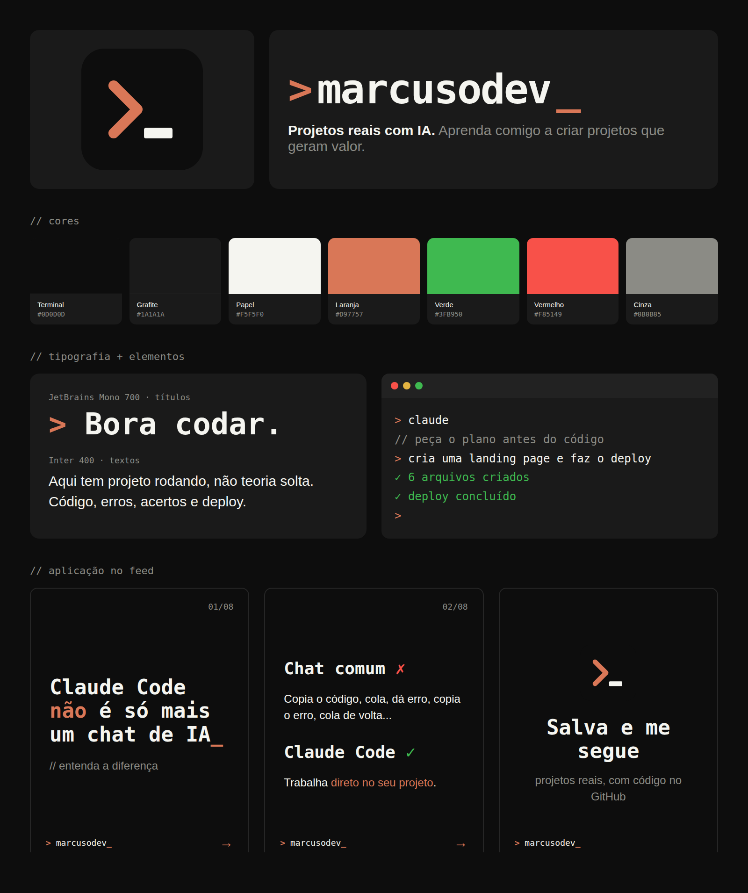

# @marcusodev — Instagram profissional

> **Do prompt ao deploy.**

Central de conteúdo aberta do meu Instagram sobre **programação, LLMs, projetos reais e Claude Code**.

**Objetivo:** ajudar a galera a construir projetos de verdade com IA, ganhar audiência e, no futuro, vender cursos de como criar projetos usando Claude Code.

## Material aberto

Tudo aqui é aberto para a galera usar e se inspirar: o [manual da marca](marca/manual-da-marca.md) com a paleta e as fontes, os [logos](marca/logo/), o [template HTML de carrossel](templates/carrossel/) e os scripts que geram e publicam os posts.

## Estrutura

| Pasta | O que tem |
|---|---|
| [`marca/`](marca/) | [Manual da marca](marca/manual-da-marca.md), logo, [painel visual](marca/painel-da-marca.png), bio e público |
| [`estrategia/`](estrategia/) | Pilares de conteúdo e funil até a venda dos cursos |
| [`calendario/`](calendario/) | Planejamento mês a mês |
| [`posts/`](posts/) | Uma pasta por post: `roteiro.md`, `carrossel.html` e as imagens em `slides/` |
| [`templates/`](templates/) | Modelo de roteiro e [template HTML dos carrosséis](templates/carrossel/) |
| [`scripts/`](scripts/) | Geração dos slides e [publicação no Instagram](docs/publicar-no-instagram.md) |

## Fluxo de trabalho

1. Escolher o post da semana no [calendário](calendario/mes-01.md).
2. Criar a pasta `posts/NN-tema/` com o [roteiro](templates/post.md) e, se for carrossel, o [HTML do carrossel](templates/carrossel/).
3. Escrever o gancho, o roteiro e a legenda.
4. Gerar as artes com `npm run slides -- posts/NN-tema/carrossel.html` (ou gravar o vídeo, se for Reel).
5. Fazer commit e push, conferir com `npm run publicar -- posts/NN-tema` e publicar com `--publicar` (veja [como publicar](docs/publicar-no-instagram.md)). Marcar como ✅ no calendário.
6. Anotar as métricas depois de 7 dias (alcance, salvamentos, compartilhamentos, comentários e seguidores ganhos).
